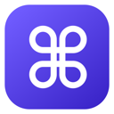

<p align="center">
  
</p>

<h1 align="center">CmdZ</h1>

<p align="center">
  Reopen your most recently closed Chrome tab with <kbd>Command</kbd> + <kbd>Z</kbd>.
</p>

CmdZ brings Safari's familiar reopen-tab shortcut to Google Chrome on macOS. It is a focused Manifest V3 extension with no popup, settings, analytics, page access, or network access.

## Features

- Restores the most recently closed tab with <kbd>Command</kbd> + <kbd>Z</kbd>
- Skips closed-window sessions and restores the latest individual tab
- Runs only when invoked, using a lightweight extension service worker
- Requests one permission: `sessions`
- Contains no third-party dependencies or remotely hosted code

## Install

CmdZ is not currently published in the Chrome Web Store. Install it locally in a few steps:

1. Download or clone this repository:

   ```sh
   git clone https://github.com/patrykchojecki/CmdZ.git
   ```

   Alternatively, download [`dist/CmdZ-1.0.0.zip`](dist/CmdZ-1.0.0.zip) and extract it.

2. Open `chrome://extensions` in Google Chrome.
3. Enable **Developer mode** in the upper-right corner.
4. Click **Load unpacked**.
5. Select the repository folder, or the folder extracted from the release ZIP.
6. Close a tab and press <kbd>Command</kbd> + <kbd>Z</kbd>.

### Shortcut troubleshooting

Chrome can leave a suggested shortcut unassigned when it conflicts with another browser or extension command. If CmdZ does not respond:

1. Open `chrome://extensions/shortcuts`.
2. Find **CmdZ**.
3. Assign <kbd>Command</kbd> + <kbd>Z</kbd> to **Reopen the most recently closed tab**.

Because <kbd>Command</kbd> + <kbd>Z</kbd> is also the standard Undo shortcut, Chrome or editable page elements may take priority in some contexts.

For bug reports and diagnostic details, see [Support](SUPPORT.md).

## How it works

The manifest registers a macOS keyboard command. When invoked, the service worker asks Chrome for recently closed sessions, finds the newest individual tab, and restores it by session ID.

CmdZ requires Chrome 96 or newer and uses only official Chrome extension APIs.

## Privacy

CmdZ does not collect, store, or transmit data. The `sessions` permission is required solely to identify and restore recently closed tabs. The extension has no host permissions and cannot read page content. See the full [Privacy Policy](PRIVACY.md).

## Chrome Web Store

The upload package, required listing graphics, dashboard copy, privacy disclosures, and submission checklist are prepared in [Chrome Web Store submission](STORE_LISTING.md).

## Project structure

```text
CmdZ/
├── background.js       # Keyboard command and tab restoration logic
├── manifest.json       # Manifest V3 configuration
├── icons/              # Source and Chrome extension icons
├── store-assets/       # Chrome Web Store listing graphics
├── scripts/            # Release packaging script
├── PRIVACY.md          # Public privacy policy
├── STORE_LISTING.md    # Dashboard copy and submission checklist
└── dist/               # Ready-to-upload extension package
```

## Development

There is no build step and no dependency installation. Edit the source files, then click **Reload** for CmdZ on `chrome://extensions`.

Run the basic validation checks with:

```sh
node --check background.js
python3 -m json.tool manifest.json >/dev/null
unzip -t dist/CmdZ-1.0.0.zip
```

To rebuild the distributable archive from the repository root:

```sh
./scripts/package-extension.sh
```

## License

CmdZ is available under the [MIT License](LICENSE).
